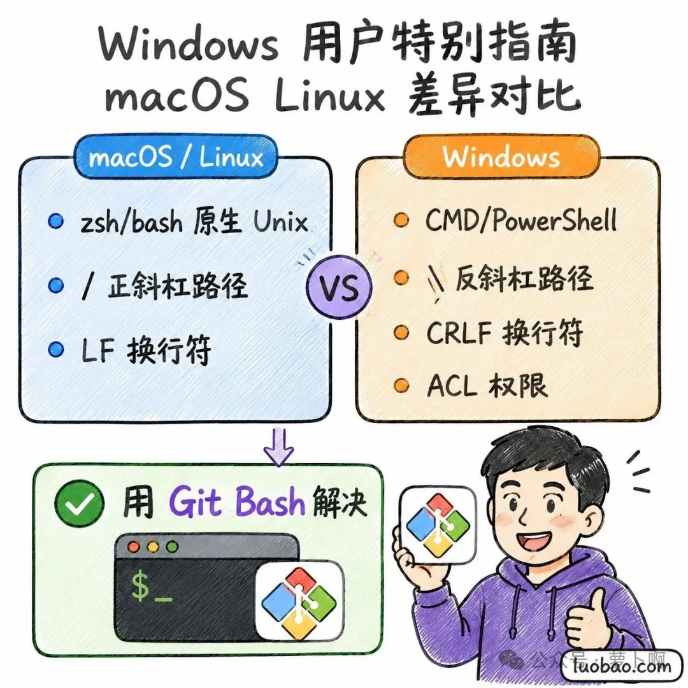

# Claude Code从零到精通教程第1章：环境准备装好你的基础设施

> 最近忙着写小游戏，之前本来想录制教学视频的，但一直没时间，还是先把大纲放出来吧。
> 
> **第一阶段包含四个章节**：主要任务是快速上手——从安装到跑通第一个任务
> 
> **本阶段目标**：完成环境搭建、Claude Code 安装、国产模型配置，并成功执行你的第一个任务。预计用时 1-2 小时。

## 第1章 环境准备：装好你的“基础设施”

Claude Code 运行在你的电脑上，但它需要两个底层支撑：**Node.js** 和 **Git**。本章帮你把这两个装好并验证通过。

### 1.1 Node.js 安装与验证


#### 为什么需要 Node.js？

Claude Code 是用 Node.js 写的，你可以把它理解为“Claude Code 的运行底座”。没有 Node.js，Claude Code 命令根本无法执行。

Node.js 的版本要求：**≥ 18.0**，强烈建议安装最新的 LTS（长期支持版）。截至 2026 年 5 月，最新 LTS 版本为 Node.js 22.x。

#### macOS 安装（推荐 Homebrew）

如果你的 Mac 上还没有 Homebrew，先去 brew.sh 复制安装命令，在终端执行即可。

有了 Homebrew 之后，安装 Node.js 就是一句话：

```
brew install node
```

安装完成后验证：

```
node --version
# 应输出类似 v22.13.0
npm --version
# 应输出类似 10.9.2
```

如果你已经装了 Node.js 但版本低于 18.0，先用 Homebrew 升级：

```
brew upgrade node
```

#### Windows 安装

Windows 有两种推荐方式：

**方式一：官网下载（推荐新手）**

1.  打开 nodejs.org
    
2.  点击左侧的 LTS 版本下载（右侧是最新版，不太稳定）
    
3.  运行 `.msi` 安装包，一路 Next 即可
    
4.  安装过程中确保勾选 **“Add to PATH”** 选项
    

**方式二：WinGet 命令行安装**

如果你已经启用了 WinGet（Windows 11 自带，Windows 10 需手动安装）：

```
winget install OpenJS.NodeJS.LTS
```

安装完成后，**打开 Git Bash**（不是 CMD，不是 PowerShell），验证：

```
node --version
npm --version
```

> **⚠️ Windows 用户重要提醒**：本书所有涉及 Windows 的终端操作，**全部在 Git Bash 中执行**。这是因为 Claude Code 底层使用 Unix 风格的命令，Git Bash 提供了一个兼容的 Shell 环境。如果你使用 CMD 或 PowerShell，会遇到各种奇怪的命令找不到的报错。

#### Linux 安装（以 Ubuntu 为例）

使用 NodeSource 仓库安装最新的 LTS 版本：

```
curl -fsSL https://deb.nodesource.com/setup_lts.x | sudo -E bash -
sudo apt-get install -y nodejs
```

验证：

```
node --version
npm --version
```

#### 常见踩坑

问题|原因|解决
-|-|-|
'node: command not found'|没装或 PATH 未配置|重新安装并确保勾选 Add to PATH
版本低于 18.0|装了旧版|升级到最新 LTS
'npm install -g'，报权限错误（macOS/Linux）|npm 全局目录需要 sudo|加 `sudo`，或用 nvm 管理 Node.js

> **作者建议**：如果你对终端操作不太熟悉，用 nvm（Node Version Manager）来管理 Node.js 版本是最省心的选择，可以随时切换版本而不污染系统环境。nvm 的安装和使用可以在官网找到，此处不展开。

### 1.2 Git 安装与基础配置


#### 为什么 Claude Code 依赖 Git？

Claude Code 对 Git 的依赖程度远超你的想象：

-   版本管理： 每次修改代码后，Claude Code 会自动创建 commit，方便回滚
-   上下文感知： 通过 Git 了解项目结构、文件变更历史
-   安全隔离： 在 Git 分支上操作，不会污染主分支
-   命令执行： **Windows 环境下，Claude Code 底层使用 Git Bash 来执行 Shell 命令**  

换句话说，没有 Git，Claude Code 根本跑不起来。

#### macOS 安装
```
brew install git
```

#### Windows 安装（特别注意）

Windows 用户**必须**先安装 Git，安装时有两个关键选项：

1.  下载 git-scm.com 的安装包
    
2.  安装过程中，在 **“Choosing the default editor”** 页面选择一个你熟悉的编辑器（推荐 VS Code 或 Nano）
    
3.  在 **“Adjusting your PATH environment”** 页面，选择 **“Git from the command line and also from 3rd-party software”**（第二个选项）
    
4.  在 **“Configuring the line ending conversions”** 页面，选择 **“Checkout as-is, commit as-is”**（防止换行符混乱）
    
5.  其他选项保持默认，一路 Next 完成安装

安装完成后，在开始菜单找到 **Git Bash**，打开它，这就是你之后要和 Claude Code 交互的终端。

#### Linux 安装
```
sudo apt-get install git
```

#### 验证安装
```
git --version
# 应输出类似 git version 2.45.0
```

版本要求 **≥ 2.23.0**（此版本引入了 `git switch` 等 Claude Code 使用的命令）。

#### 基础配置

安装完成后，设置你的用户名和邮箱（这是 Git 的必须配置，Claude Code 提交代码时会用到）：
```
git config --global user.name "你的名字"
git config --global user.email "你的邮箱@example.com"            `
```

验证配置：

```
git config --global user.name
git config --global user.email
```

### 1.3 终端基础速成（面向非程序员）


如果你以前从来没有打开过终端，这一节是写给你的。如果你已经熟悉终端操作，可以跳到 1.4 节。

#### 终端是什么？

终端（Terminal）是一个**用文字和电脑交互的界面**。没有图形界面，没有鼠标点击，一切靠键盘输入命令。

它看起来可能有点吓人——黑底白字、光标闪烁——但别怕，你只需要掌握 5 个命令，就足够跟随本书完成所有操作了。

#### 必会的 5 个命令

命令|作用|示例
-|-|-|
`pwd`|**P**，rint **W**orking **D**irectory，查看当前在哪个文件夹|输入 `pwd`，显示 `/Users/yourname`
`ls`，（Mac/Linux）或 `dir`（Windows）|**L**，i**s**t，列出当前文件夹里的所有文件|输入 `ls`，看到一堆文件名
`cd 文件夹名`|**C**，hange **D**irectory，进入某个文件夹|`cd Documents`，进入文档目录
`cd ..`|返回上一级文件夹|从 `Documents` 返回上级
`mkdir 文件夹名`|**M**，a**k**e **Dir**ectory，创建新文件夹|`mkdir my-project`，创建一个项目文件夹

#### 文件路径的概念

-   绝对路径： 从根目录开始的完整路径，如 `/Users/yourname/Documents/project`  
    
-   相对路径： 从当前位置出发的路径，如 `./src`（当前目录下的 src 文件夹）、`../`（上一级）  
    

> **一个小习惯**：当你看到教程里写的 `~/` 开头的路径，`~` 是你的“用户主目录”的简写。在 Mac/Linux 上是 `/Users/你的用户名`，在 Windows 上是 `C:\Users\你的用户名`。

#### 几个实用小技巧

1.  Tab 自动补全： 输入文件夹或文件名的一半，按 Tab 键会自动补全。这是提高效率最关键的习惯。
2.  上下箭头翻历史命令： 按 ↑ 键可以调出之前输过的命令，不用重新打。
3.  `clear` 清屏： 终端太乱了？输入 `clear` 回车，世界清净了。

### 1.4 Windows 用户特别指南



如果你是 Windows 用户，这一节请仔细阅读，它能帮你避开 80% 的常见问题。

#### Windows 与其他平台的核心差异

差异项|macOS / Linux|Windows
-|-|-|
命令行环境|zsh / bash（原生 Unix）|CMD / PowerShell（微软自有）
路径分隔符|`/`，（正斜杠）|`\`，（反斜杠）
权限模型|基于用户和文件权限位|基于 ACL，更复杂
换行符|LF（`\n`）|CRLF（`\r\n`）

Claude Code 是为 Unix 环境设计的，它在 Windows 上运行时，需要 Git Bash 来提供 Unix 兼容的 Shell 环境。这就是为什么我反复强调：**在 Windows 上用 Git Bash，不要用 CMD 或 PowerShell**。

#### Git Bash 的正确打开方式

1.  在开始菜单搜索 “Git Bash”，打开它
    
2.  你会看到一个类似 Linux 终端的窗口，这就是你的 Claude Code 工作台
    
3.  在 Git Bash 里，路径使用正斜杠 `/`，例如 `cd /c/Users/yourname/`
    
4.  ~ 代表你的用户主目录，即 `/c/Users/yourname/`

#### Windows 用户常见专属问题

这里先列出几个高频问题，完整的排错指南在附录 B 中。

**问题一：`node: command not found`**

明明装了 Node.js，但 Git Bash 里说找不到。原因：安装 Node.js 时没有勾选 “Add to PATH”，或者装完后没有重启 Git Bash。

解决：重启 Git Bash；如果还不行，重新运行 Node.js 安装包，确保勾选 PATH 选项。

**问题二：中文文件名显示乱码**

Git Bash 默认编码可能不是 UTF-8。在 Git Bash 窗口顶部右键 → Options → Text → Locale 选 `zh_CN`，Character set 选 `UTF-8`。

**问题三：路径中有空格导致命令报错**

如果路径中有空格（如 `My Documents`），用双引号包裹：`cd "My Documents"`。

### 本章小结

完成本章后，你应该已经：

-   安装了 Node.js（版本 ≥ 18.0）
    
-   安装了 Git（版本 ≥ 2.23.0）
    
-   配置了 Git 用户名和邮箱
    
-   学会了终端的基本操作（非程序员）
    

**验证清单**：
```
node --version   # 应 ≥ 18.0
npm --version    # 应该正常显示
git --version    # 应 ≥ 2.23.0
git config user.name   # 应显示你设置的名字
```

全部通过？好，进入第 2 章，开始安装 Claude Code 本身。
